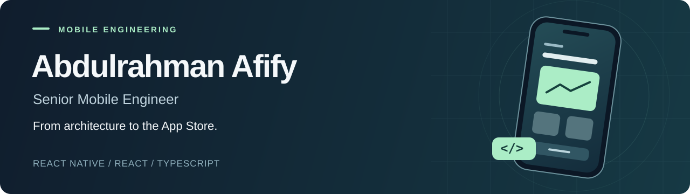

  

  <a href="https://abdulrahman-afify-portfolio.vercel.app/"><strong>Explore my work</strong></a> &nbsp; / &nbsp;
  <a href="https://abdulrahman-afify-portfolio.vercel.app/cv.pdf"><strong>Download CV</strong></a> &nbsp; / &nbsp;
  <a href="https://linkedin.com/in/abdulrahman-a-764151162/">LinkedIn</a> &nbsp; / &nbsp;
  <a href="mailto:Abdulrahman3fify@gmail.com">Email me</a>

Based in Muscat, Oman · Open to senior software engineering and mobile technical lead roles

## I build mobile products people rely on.

I'm Abdulrahman, a **Senior Mobile Engineer with 9+ years of experience** across telecom, commerce, fintech, and healthcare. I take iOS and Android products from architecture through release and production support, with React Native and TypeScript at the core.

My work spans building apps from scratch, leading engineering teams, migrating live native apps, and improving the performance and reliability of products used by millions.

<table>
  <tr>
    <td align="center" width="33%"><h3>2M+ users</h3>Homzmart · built from scratch and scaled</td>
    <td align="center" width="33%"><h3>99.5% crash-free</h3>Musaned · production reliability</td>
    <td align="center" width="33%"><h3>50+ apps</h3>Shipped across my career</td>
  </tr>
</table>

## Selected work

| Product | My contribution | Outcome |
| :--- | :--- | :--- |
| **[Ooredoo Qatar](https://apps.apple.com/qa/app/ooredoo-qatar/id619828745)** · Telecom | React Native delivery at iHorizons across consumer and business apps; payment integrations and Azure DevOps CI/CD. | **35% faster app performance** across products serving 2.5M+ consumer users and 10,000+ enterprise users. |
| **[Vodafone Oman](https://apps.apple.com/om/app/my-vodafone-oman/id1589071343)** · Telecom | Technical leadership across architecture, implementation, code quality, and release delivery. | Led the live iOS/Android app's **migration from native to React Native and Expo**. |
| **[Musaned](https://apps.apple.com/sa/app/musaned-domestic-labor/id1659263483)** · GovTech | Mobile architecture and leadership of a five-person engineering pod at Tamkeen Technology. | Scaled from **50K to 200K+ downloads**, with **99.5% crash-free sessions** and **28% faster cold starts**. |
| **[Homzmart](https://apps.apple.com/us/app/homzmart/id1533578928)** · Commerce | Built the React Native app from scratch and led mobile delivery, checkout, testing, and release pipelines. | Scaled to **2M+ users**, reached **98.7% crash-free sessions**, and reduced cart abandonment by **15%**. |
| **[Calo](https://apps.apple.com/eg/app/calo/id1497894777)** · Health & Food | React Native engineering for the meal-subscription platform, GraphQL query optimization, and release delivery with Zustand, CodePush, and Firebase. | Supported **500K+ monthly active users**, reduced API latency by **35%**, and shipped **12 major releases in six months**. |

**[See more projects, screenshots, and store links →](https://abdulrahman-afify-portfolio.vercel.app/)**

## What I bring to a team

- **Architecture that supports delivery:** React Native and Expo, shared web/mobile business logic, native Swift/Kotlin integrations, and state management.
- **Ownership through production:** CI/CD, store releases, payment flows, crash monitoring, and performance profiling.
- **Technical leadership:** Engineering direction, code quality, mentoring, and hands-on delivery with mobile teams.

## Tools I work with

| Area | Technologies |
| :--- | :--- |
| **Mobile & web** | React Native · Expo · React · TypeScript · JavaScript · Swift/Kotlin native modules |
| **State & APIs** | Redux Toolkit · Zustand · TanStack Query · GraphQL · REST |
| **Backend & services** | Node.js · Firebase · Supabase · SQL |
| **Delivery** | GitHub Actions · Azure DevOps · Fastlane · EAS · App Store & Google Play |
| **Quality & observability** | Jest · Detox · Sentry · Crashlytics · Instabug · Amplitude · AppsFlyer |

## Explore the work

**[Portfolio website](https://abdulrahman-afify-portfolio.vercel.app/)** — Selected products, career history, screenshots, and links to released apps.

**[Portfolio source](https://github.com/Abdulrahman3fify/portfolio)** — The React, TypeScript, and Vite code behind the site.

Most of my production work is in private client repositories. The portfolio presents the projects and outcomes I can share publicly.

---

### Let's build something people use.

I'm open to **senior software engineering roles focused on mobile** and **mobile technical lead opportunities**, remote or on-site.

**[Book a 30-minute conversation](https://calendly.com/abdulrahmanafify-95/30min)** · **[Abdulrahman3fify@gmail.com](mailto:Abdulrahman3fify@gmail.com)** · **[CV](https://abdulrahman-afify-portfolio.vercel.app/cv.pdf)**
